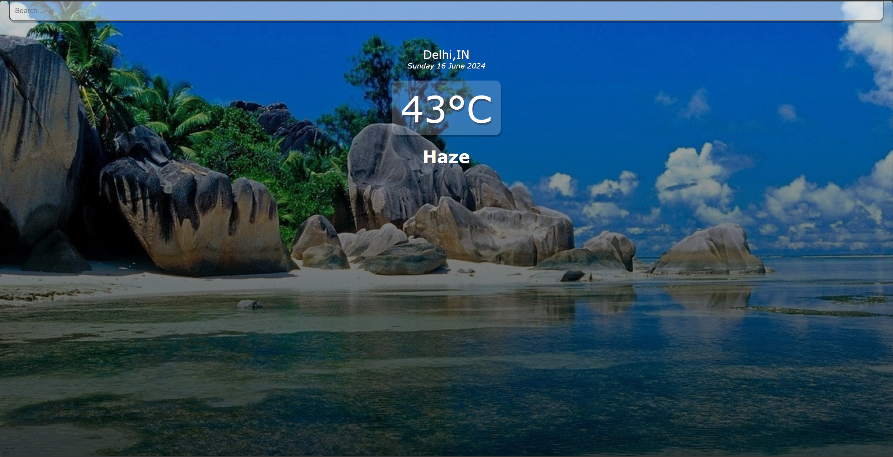
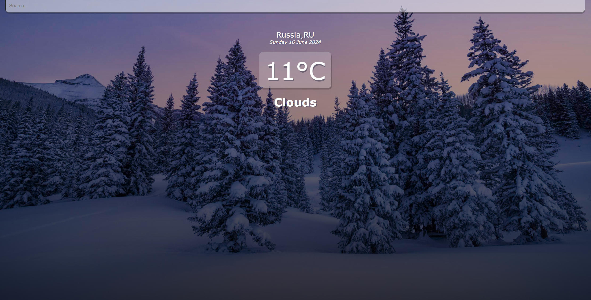

# Weather Application

The Weather Application is a sleek and user-friendly web application designed to provide you with accurate and up-to-date weather information. Built using the power of React, JavaScript, HTML, CSS, and JSX, this application offers a beautiful interface that allows users to obtain weather-related information for any desired location. The Weather Application provides essential information such as place, country, day and time, temperature, and overall weather conditions (e.g., haze, clouds, sunny). 

Users can input the name of the place they want to see the weather for, and the application queries the OpenWeatherMap API in the backend, reflecting the information in a visually appealing manner. Based on the weather of the searched place, the background of the web application changes to help the user get a better feel of the weather conditions.

# Features
* **Elegant User Interface**: Enjoy a clean and modern design that enhances user experience and makes checking the weather enjoyable.
* **Weather Information**: Quickly view the weather by entering the name of any place. Information includes place, country, day and time, temperature, and overall weather conditions.
* **Dynamic Background**: The background of the application changes based on the weather of the searched place, providing a more immersive experience.
* **Input Space**: An intuitive input space is provided for users to enter the name of the place they want to see the weather for.
* **Responsive Design**: The application is fully responsive, ensuring a seamless experience on both mobile devices and desktop computers.
* **Error Handling**: Robust error handling ensures that the application runs smoothly, providing a smooth and error-free experience.

# Technologies Used
* **React**: The core logic of the application is implemented using React, handling all user interactions and dynamic updates.
* **JavaScript**: Handles various functionalities and API requests.
* **HTML**: Provides the structure of the web application, including input fields and display areas.
* **CSS**: Styles the application, offering an aesthetically pleasing and responsive design that adapts to various screen sizes.
* **JSX**: Combines JavaScript and HTML-like syntax for React components.

# How It Works
1. **User Interface**:
    * The main interface presents an input space for entering the name of the place you want to see the weather for.
    * The display area shows the place, country, day and time, temperature, and overall weather conditions.

2. **Getting Weather Information**:
    * Enter the name of the place in the input field.
    * Click the "Get Weather" button to query the OpenWeatherMap API.
    * The weather information is displayed dynamically, and the background changes according to the weather conditions.

3. **Viewing Weather Information**:
    * All relevant weather information is displayed, including place, country, day and time, temperature, and overall weather conditions.
    * The background dynamically changes to reflect the weather conditions, providing an immersive experience.

# Guidelines
## Setup
1. **Clone the Repository**:
    ```bash
    git clone https://github.com/hungrycarpet/React-Projects.git
    ```
2. **Navigate to the Project Directory**:
    ```bash
    cd Weather-App
    ```
3. **Install Dependencies**:
    ```bash
    npm install
    ```
4. **Start the Application**:
    ```bash
    npm start
    ```

## Project Structure
* `src/`: Contains all the source code, including components, services, and styles.
* `public/`: Contains the public assets and the main `index.html` file.
* `index.html`: The entry point for the web application.
* Other typical React project files like `package.json`, `.gitignore`, etc.

# Screenshots

## Hot Weather Example 


## Cold Weather Example 


# Contact
For any queries or feedback, please contact me at ***manasparasar@gmail.com***

# License
MIT License

Copyright (c) 2019 Manas Mishra

Permission is hereby granted, free of charge, to any person obtaining a copy
of this software and associated documentation files (the "Software"), to deal
in the Software without restriction, including without limitation the rights
to use, copy, modify, merge, publish, distribute, sublicense, and/or sell
copies of the Software, and to permit persons to whom the Software is
furnished to do so, subject to the following conditions:

The above copyright notice and this permission notice shall be included in all
copies or substantial portions of the Software.

THE SOFTWARE IS PROVIDED "AS IS", WITHOUT WARRANTY OF ANY KIND, EXPRESS OR
IMPLIED, INCLUDING BUT NOT LIMITED TO THE WARRANTIES OF MERCHANTABILITY,
FITNESS FOR A PARTICULAR PURPOSE AND NONINFRINGEMENT. IN NO EVENT SHALL THE
AUTHORS OR COPYRIGHT HOLDERS BE LIABLE FOR ANY CLAIM, DAMAGES OR OTHER
LIABILITY, WHETHER IN AN ACTION OF CONTRACT, TORT OR OTHERWISE, ARISING FROM,
OUT OF OR IN CONNECTION WITH THE SOFTWARE OR THE USE OR OTHER DEALINGS IN THE
SOFTWARE.
