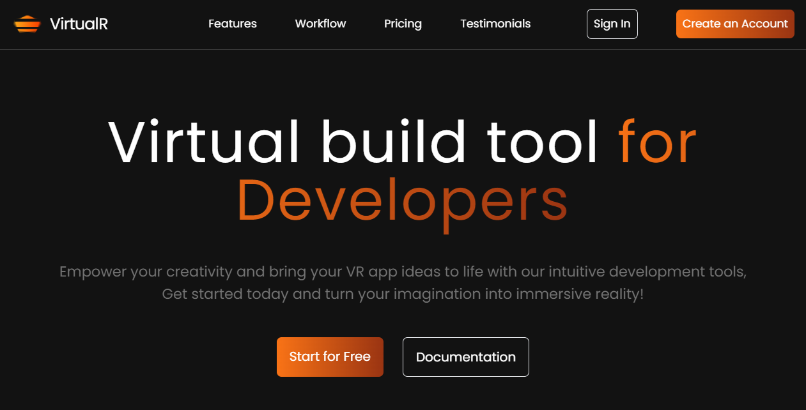
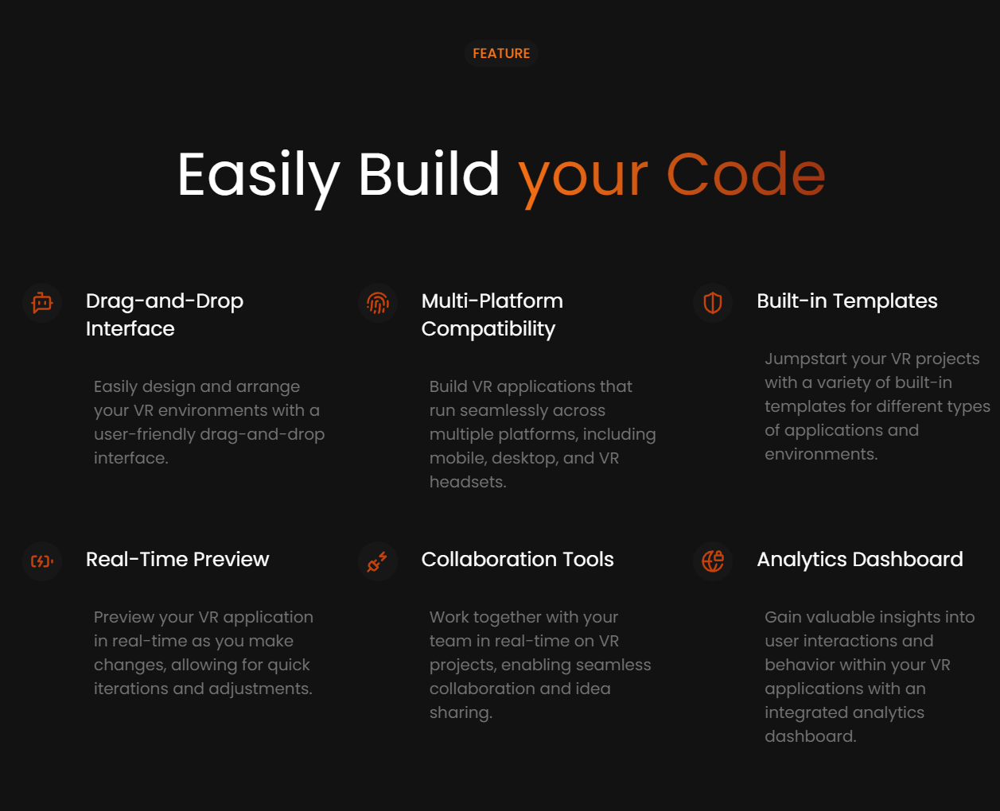
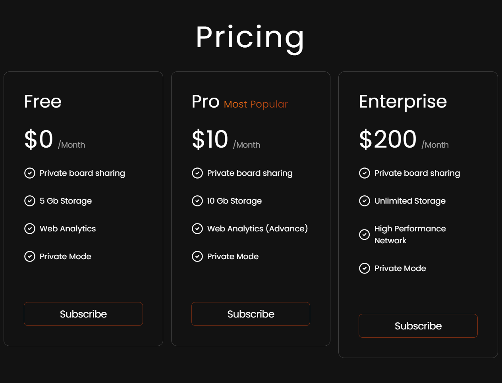
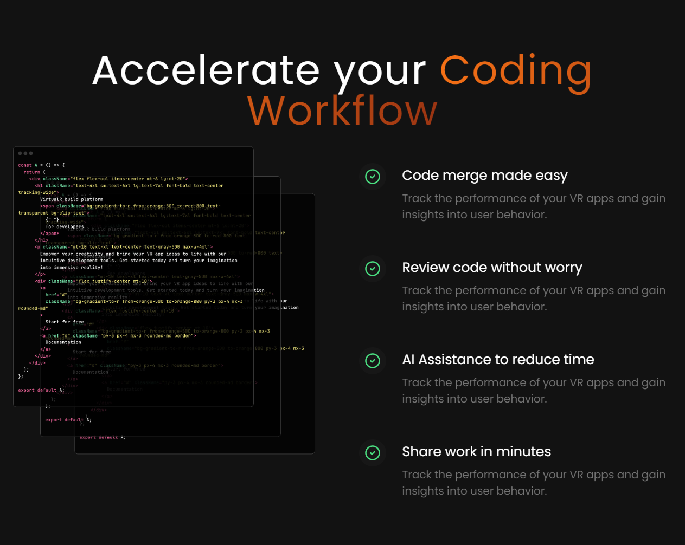

# VirtualR - VR Application Building Tool

VirtualR is a dedicated tool for building VR applications with ease and efficiency. Designed with a sleek and user-friendly interface, VirtualR empowers users to create immersive VR environments and applications effortlessly. Built using React, Vite, JavaScript, HTML, Tailwind CSS, and JSX, this web application provides a comprehensive suite of features tailored for VR development.

## Features

- **Interactive VR Design**: Create and customize VR environments through an interactive and visually appealing interface.
- **Effortless VR Application Building**: Build VR applications seamlessly with an intuitive workflow, making development convenient and swift.
- **Comprehensive Sections**: Includes Home, Features, Workflow, Pricing, and Testimonials sections for easy navigation and information access.
- **Contact and Footer**: Easily contact us through the provided contact section and footer, ensuring seamless communication.
- **Responsive Design**: Enjoy a consistent user experience across all devices, from desktops to tablets and mobile phones.
- **Error Handling**: Robust error handling ensures smooth operation, providing users with a hassle-free VR application development experience.
  
## Technologies Used

- **React**: Powers the core functionality and dynamic updates within the application.
- **Vite**: Provides a fast and optimized development environment for the project.
- **JavaScript**: Handles various functionalities and interactions.
- **HTML**: Provides the structure and layout of the web pages.
- **Tailwind CSS**: Styles the application, ensuring an attractive and user-friendly design with utility-first CSS.
- **JSX**: Combines JavaScript and HTML-like syntax for React components, enhancing code readability and maintainability.

## How It Works

### Home Section

- **Welcome Message**: Introduces users to VirtualR with an inviting overview of its capabilities and benefits.
- **Introduction Video**: A short video that demonstrates the power and ease of use of VirtualR.

### Features Section

- **Detailed Features**: Explains the key features such as Drag-and-Drop Interface, Multi-Platform Compatibility, Built-in Templates, Real-Time Preview, Collaboration Tools, and Analytics Dashboard.
- **Screenshots and Demos**: Visual representations and demo videos of the features in action.

### Workflow Section

- **Step-by-Step Guide**: Provides a detailed guide on how to start a new VR project, from initial setup to deployment.
- **Interactive Tutorials**: Hands-on tutorials to help users get accustomed to using VirtualR efficiently.

### Pricing Section

- **Pricing Plans**: Information about different subscription plans, including Free, Pro, and Enterprise options.
- **Feature Comparison**: A comparison chart to help users choose the best plan for their needs.

### Testimonials Section

- **Customer Reviews**: Displays authentic testimonials from satisfied users, highlighting their experiences and the benefits they have gained from using VirtualR.

## Guidelines

### Setup

1. **Clone the Repository**:
    ```bash
    git clone https://github.com/hungrycarpet/React-Projects.git
    ```
2. **Navigate to the Project Directory**:
    ```bash
    cd VirtualR-Landing-Page
    ```
3. **Install Dependencies**:
    ```bash
    npm install
    ```
4. **Start the Application**:
    ```bash
    npm run dev
    ```

### Project Structure

- `src/`: Contains all the source code, including components, services, and styles.
- `public/`: Contains public assets and the main `index.html` file.
- `index.html`: Entry point for the web application.
- Other typical React project files like `package.json`, `.gitignore`, etc.

## Screenshots

### Home


### Features


### Pricing


### Workflow


## Contact

For any queries or feedback, please contact us at ***manasparasar@gmail.com***.

## License

MIT License

Copyright (c) 2019 Manas Mishra

Permission is hereby granted, free of charge, to any person obtaining a copy
of this software and associated documentation files (the "Software"), to deal
in the Software without restriction, including without limitation the rights
to use, copy, modify, merge, publish, distribute, sublicense, and/or sell
copies of the Software, and to permit persons to whom the Software is
furnished to do so, subject to the following conditions:

The above copyright notice and this permission notice shall be included in all
copies or substantial portions of the Software.

THE SOFTWARE IS PROVIDED "AS IS", WITHOUT WARRANTY OF ANY KIND, EXPRESS OR
IMPLIED, INCLUDING BUT NOT LIMITED TO THE WARRANTIES OF MERCHANTABILITY,
FITNESS FOR A PARTICULAR PURPOSE AND NONINFRINGEMENT. IN NO EVENT SHALL THE
AUTHORS OR COPYRIGHT HOLDERS BE LIABLE FOR ANY CLAIM, DAMAGES OR OTHER
LIABILITY, WHETHER IN AN ACTION OF CONTRACT, TORT OR OTHERWISE, ARISING FROM,
OUT OF OR IN CONNECTION WITH THE SOFTWARE OR THE USE OR OTHER DEALINGS IN THE
SOFTWARE.
